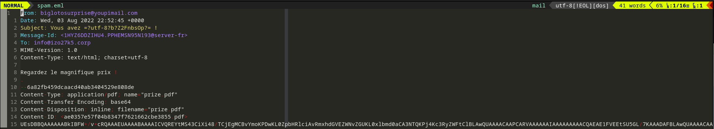
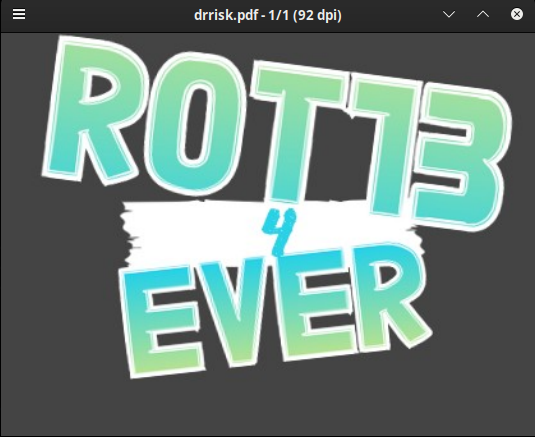

# Polypocket 

|difficulté|type|
|:---:|:---:|
|Moyen|Forensic|

## Enoncé
Encore un spam !

Il faut vraiment que nos services mettent \u00e0 jour notre serveur de messagerie.

## Analyse

On nous fourni dans ce chall, un fichier .eml, vous pouvez l'analyser avec les outils que vous voulez, mais je vous déconseille d'utiliser un mailer quand vous êtes sur un email suspect.
Pour ma part, je vais utiliser mon bon vieux Vim:



Ce que nous remarquons, c'est une chaine en base64 qui constitue le message en lui même, nous allons donc d'extraire avec la commande suivante:

```bash
tail -n 1 spam.eml > base64.txt
```

Une fois la chaine extraite, nous allons pouvoir regarder ce qu'elle veut dire une fois décodée:

```bash
cat base64.txt | base64 -d | xxd | head -n 10
00000000: 504b 0304 1400 0000 0000 1908 0455 befe  PK...........U..
00000010: ff9c 4500 0000 4500 0000 0100 0000 2025  ..E...E....... %
00000020: 5044 462d 312e 370a 25e2 e3cf d30a 3120  PDF-1.7.%.....1 
00000030: 3020 6f62 6a0a 3c3c 0a2f 4669 6c74 6572  0 obj.<<./Filter
00000040: 202f 466c 6174 6544 6563 6f64 650a 2f4c   /FlateDecode./L
00000050: 656e 6774 6820 3735 340a 3e3e 0a73 7472  ength 754.>>.str
00000060: 6561 6d0a 504b 0304 1400 0000 0800 0f08  eam.PK..........
00000070: 0455 0000 0000 0200 0000 0000 0000 0900  .U..............
00000080: 0400 4d45 5441 2d49 4e46 2ffe ca00 0003  ..META-INF/.....
00000090: 0050 4b03 0414 0000 0008 000f 0804 5512  .PK...........U.
```

Ce qui saute au yeux dans ce fichier, c'est qu'il a deux entête, il a celle d'un ZIP et c'elle d'un fichier PDF

ZIP:
```bash
00000000: 504b 0304 1400 0000 0000 1908 0455 befe  PK...........U..
00000010: ff9c 4500 0000 4500 0000 0100 0000 2025  ..E...E....... %
```

PDF:
```bash
00000010: ff9c 4500 0000 4500 0000 0100 0000 2025  ..E...E....... %
00000020: 5044 462d 312e 370a 25e2 e3cf d30a 3120  PDF-1.7.%.....1 
00000030: 3020 6f62 6a0a 3c3c 0a2f 4669 6c74 6572  0 obj.<<./Filter
00000040: 202f 466c 6174 6544 6563 6f64 650a 2f4c   /FlateDecode./L
00000050: 656e 6774 6820 3735 340a 3e3e 0a73 7472  ength 754.>>.str
00000060: 6561 6d0a 504b 0304 1400 0000 0800 0f08  eam.PK..........
00000070: 0455 0000 0000 0200 0000 0000 0000 0900  .U..............
00000080: 0400 4d45 5441 2d49 4e46 2ffe ca00 0003  ..META-INF/.....
00000090: 0050 4b03 0414 0000 0008 000f 0804 5512  .PK...........U.
```

## Résolution

Pour savoir qui ce skyzophrène est réellement, nous allons recréer le fichier, et l'analyser avec la commande **file**:

Reconstruction:

```bash
cat base64.txt | base64 -d > drrisk
```

puis:

```bash
file drrisk
drrisk: Zip archive data, at least v2.0 to extract, compression method=store
```

Nous avons donc désormais deux nouveaux répertoire, **META-INF** et **PDF**, mon instinct me pousse à regarder ce qu'il y a dans **PDF**:

```bash
ls PDF/
Main.class
```

Tiens, un fichier java compilé, nous allons pouvoir regarder ce qu''il contient grace à Jadx:

```bash
jadx PDF/Main.class
INFO  - loading ...
INFO  - processing ...
INFO  - progress: 0 of 1 (0%)
INFO  - done
```

Nous trouverons ce qu'il contient en naviguant dans le répertoire créé Main/source/PDF/Main.java:
```java
package PDF;
/* loaded from: Main.class */
public class Main {
    public static void main(String[] strArr) {
        System.out.println("VAAA{C0ylty0" + "ty0g_S1y3_X4" + "a_O3_Qnatre0hf}");
    }
}
```
Nous avons donc une application qui va afficher dans la console de sortie la chaine suivante:

>VAAA{C0ylty0ty0g_S1y3_X4a_O3_Qnatre0hf}

La chaine semble encodée, mais je suis curieux de voir ce que donne le pdf avec ces deux headers, normalement, sur une analyse d'un malware, on n'ouvrirait pas le PDF, mais là, le code Java ne fait rien de grave.

```bash
cp drrisk drrisk.pdf
mupdf drrisk.pdf
```

Nous avons le magnifique PDF qui s'affiche:



Ah le [ROT13](https://fr.wikipedia.org/wiki/ROT13), ce bon vieux anti-spoiler sur Usenet, Nous allons pouvoir le décoder avec le programme rot13 qui est inclus dans le packet bsdgames:

```bash
rot13 VAAA{C0ylty0ty0g_S1y3_X4a_O3_Qnatre0hf}
INNN{P0lygl0gl0t_F1l3_K4n_B3_Danger0us} 
```

Nous avons donc le flag:
>INNN{P0lygl0gl0t_F1l3_K4n_B3_Danger0us}
