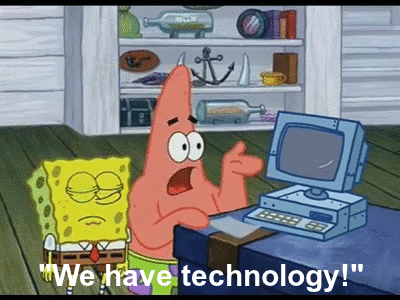
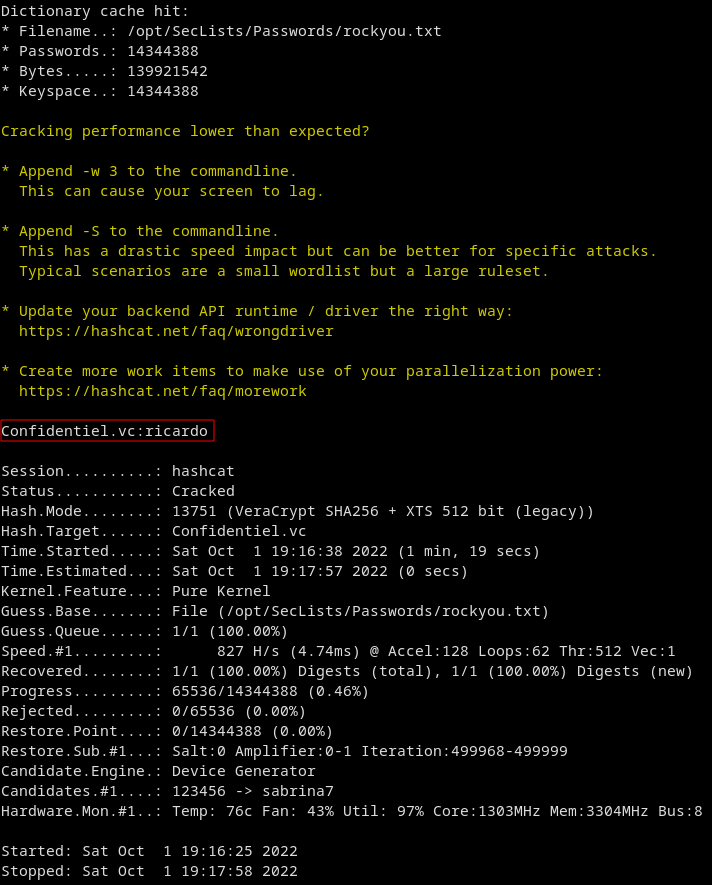
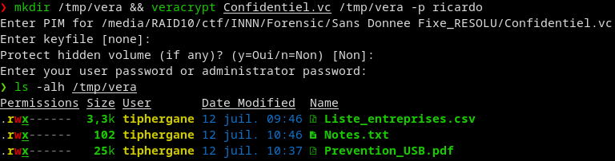

# All your base are belong to us

|difficulté|type|
|:---:|:---:|
|Difficile|Forensic|

## Énoncé
Une clé USB a été trouvée dans une poubelle verte par notre service d'entretien des surfaces.


Comme la procédure nous y oblige, seuls les papiers sont autorisés dans la poubelle verte.


Notre unité d'analyse de premier niveau en a fait une image et vous l'a transmise....


On attend votre rapport avant de la jeter dans le recyclage de déchets électroniques....

SHA1 17f128bdec976f4e45f91a9e40093b844049e802

## Analyse

C'est parti pour ce grand classique, nous avons une image d'un système de fichier que nous allons devoir analyser.
Nous commençons par essayer d'identifier le file système utilisé:

```bash
file disk.dd
disk.dd: Linux rev 1.0 ext2 filesystem data, UUID=7de36af6-daec-4de1-85de-76827f551f68 (extents) (64bit) (large files) (huge files)
```

## Récupération

Nous avons une partition Linux, au moins la clef n'a pas été effacée et nous n'allons pas faire de post-mortem dessus, maintenant, nous allons chercher s'il reste des fichiers, toutes les commandes qui suivent viennent de Sleuthkit

```bash
fls -m / -l -p disk.dd
0|/lost+found|11|d/drwx------|0|0|16384|1657616487|1657616487|1657616487|0
0|/Confidentiel.vc|12|r/rrw-------|1000|1000|1048576|1657616607|1657616004|1657619259|0
0|/$OrphanFiles|257|V/V---------|0|0|0|0|0|0|0
```

Nous avons un répertoire lost+found à la racine, le $OrphanFiles et un fichier Confidentiel.vc, nous travaillons sur l'offset 0 (début de la seule partition), et il n'y a aucun fichier supprimé.

La solution est donc dans le fichier Confidentiel, nous allons l'extraire avec icat en règlant l'offset (-O 0) et le numéro d'index du fichier (12):

```bash
icat -o 0 disk.dd 12 > Confidentiel.vc
```

puis nous allons analyser le fichier :

```bash
file Confidentiel.vc
Confidentiel.vc: data
```

Bon, pas très parlant, si on regarde dedans que voyons nous ?

```bash
cat Confidentiel.vc | head -n 5
Þµn�Öòz‚Y SNWÜÙçrݱ7í¼dž)÷چl¥1fX‚—ÒWûâ-wê֟Ñ6ûqIúò˜Å9/\´Ö³ú’Ã)u”ùÝ)èěÒ׍½(O0~³”!/5:Ô«4ŒFˆ‹ÛßÃEôȺàÙ–èÚ;ïY?D '½Q¡(å›2>ú·	7	·fAßÉd´¬P}={Á$†¥­ÚìE�
ô‰*sӐ5å™Å‚¦J©0ü;ýc—6ª7â½ÉF¶„Î5ƒ¾òÇ(˨Üœ¿¥Ÿn™NêèF5{><KìCݏ±ûn7ꂎ—$OK0©"Œ=Ëàdb³¸q÷g‡ØDëä©I#6»}ë¶Pý¨OãY<TyÙþ{ÿêhÿÁ>û<àiªÛÒ¶¥ê=ƒ²Ì-Gpÿ§r½ßå#–SBZ²¥R¹à‚ƒOÔü¸ÑQà²çÆIC±%82³°bˆ°jq³�Wÿc›Ó¢>—#ꡞùáÓ±•²÷­›Pcýœ$¨2N<—Ñî//¡…nÅ_“õÁó#~Q©n‰Ú+:i)‘¾GéTpalhì˜-Ւmuð-öZx#îK™ÃὋ0Yº|DicהÂ_$òúæÔ;h¬,NŽãkÀ”7²]ё-ˆiÆ?µÝzqz’?ãòéɛÁï*äϬyÚ°/¨"%ÝÑ÷¦ˆÒΟÿ“Èä¿Ë529²9šÏ+æºëÏ[ÑÚ²ráô)^ÝÆãô]ïfâR¬ÕÍã�¿˜x9=Ãȇt˜Ðp¹ñ/tbTÐÐÓâà5b¦?y3”RÝ<8¤ãèYb¹çvã«Ço-Aœ9`,uþ·¦Ð>Ys<Pt6«'…m挚"üÙY±ÊIòýW±$/–ÿi‚m.”¿…¦òQë:YâèpÈò	ë­Þ™5ðôr“©Qóæ +¶#t©=ÑĽ›‘d<é<±a€Œæddbhdnï8¸ÄR²…5J¢{±Gì$h;‡ÀëÇR÷uzî–•A�¬ˆ€±}¾fŸðø™dÃÞÞz.:Žß‹Ìä÷42¬}8¶Û2M‰n¬íu
Š=´ªåPÙÂ?$ðZÐÕŌ‡t×ÆٍcJ0q1ûéÓsº¼›!¬ð–·ó84ŠÃ'´ˆ30ó­VŽ,œ¯11cbÅp®¦ñ31»ÖçÑw”!s2yi¡~dPiÒiL롎ÄØú÷)|QdG‰9IË^°&áq˜%pbb´0e!v݅Òò\~oÚ/S“©¯Ny¦9Ͳ"øáVm÷¡ÇgýdO!jèg‡Có/ä3MƤ-šx•»z¶ºuŠ€BAT\ ÍÁæ§iÕå¸
L˜^Nm„ûaøº.ejmr¥oÝ]—±ÿ«·!o:%«íP~H?Á„˜Ð ´E’Α1y¸YSNÇ˞=ʧՠydî�ג]‰KIa¨“.“ÜÓ&s¯‚¸–êIˆã?|êÖºì࡜9Z‘¹ÒÇq)û{vT‘‚p`ˆº‰­Ý'¶öêÒ¦šÊieÝ\@ž_%Å$Ù%ªàCٝ¡v²iÞržcŽ!}Ô´kÃ*eº¾ó‡½PuÂʚ5òö{´lË%“5™\}ò÷ÛZü®zVöÀeØ'9ˆÑÄ=M.³¶…ùÓ`ö{i^jEÛn*5@LdæIü¨½¯&²®_	–x
M¡P“—›sz¿¹ýÃïLù-6ÜqpC¦[aD­`$uɋê-PPLüÞØwËjü_a2\ýûO1Ý.†¥™ŽYZ’û!‚$F`Øæò×GµñXD1ØVÞû&S"1Ð'{£—
=lPxJÉÔç*õnС÷ u®¯DNµÿÇB]ÁȬ¸»ÝÊzmX=Ž%©B¨ôpÅÚs:K3bB-E}vâ#CҞõõNyÁäû£˜Ó•ù4‡övžfÜ8P€#N{ãÉIh–¾rg€ýðî¡Bþ[º–µ‚ˈ;Zry­%!À
¬–/¥=ñӜJÐD—b8Dj)¤xR­Ð¦¬òW\Wà=q¶lÝŒ^b…ê_J±ùFvvõ†a:¶êuªèëcA¸•xfë`Ö·Ûc «që„À½ÄšÖ}Uƒ	ÛºöÅFd‡†ç!#‰}F€ÆŒ¢ÂÌÜBø¬Ìp¬Ísí¶Ö#ÃÄ8{¡‹ñ±¼2{}ŠÞù¡Ø"°Ë¦²àIšbÄ=·úÚb÷ÌòQ¥ìÍ¢t–ÓŒ…n_»ÊþhwOÓ>&ˆ%ušÀŠ¼V÷ɾ-°¼W_'%Tb'!ϼ‘&%„D؇)–Ysø.´ØÇiSþ“h¿³$Øÿ¥êÊþ§™øƒ­á2¬ó¯bowڇKWU·˜DRÁÌבy[efzcƒ^®ð[ô‚©}¢Ñ™Äëó„Q
```

Bon, on a une entropy de malade, le fichier semble chiffré, l'extension **.vc** me fait penser à Veracrypt, mais sur le net il parle d'un logiciel pour créer des RPG. Une peu de recherche et de fails, et l'on retourne sur notre première idée, c'est un conteneur Veracrypt.

Seulement pour le monter, il va nous manquer le mot de passe…

## Hashcat on his way

Pas grave, nous avons la technologie



Nous allons espérer que le mot de passe et l'encryption soit suffisament faible pour être reverse suffisament rapidement. Nous regardons l'algo par défaut de Veracrypt, et l'on voit que le premier proposé est celui là:

> HMAC-SHA256

Nous allons espérer que notre cible aura été basique dans ses choix:

```bash
hashcat -m 13751 -a 0 Confidentiel.vc /opt/SecLists/Passwords/rockyou.txt
```

et la réponse arrive assez rapidement:



Il nous reste plus qu'a monter le volume veracrypt:

```bash
mkdir /tmp/vera && veracrypt Confidentiel.vc /tmp/vera -p ricardo
```

On répond aux questions posée (pas de PIM, pas de keyfile, on entre le mdp superuser pour monter le volume dans le repertoire que l'on a créé)



Nous avons trois fichier, nous allons tenter le note.txt, mon instinct félin me dit que c'est le bon:

```bash
cat /tmp/vera/Notes.txt
Qm9uam91ciBSaWNhcmRvLApQZW5zZXog4CBtZXR0cmUgY2UgY29kZSBlbiBz6WN1cml06To=
SU5OTntCNHMzNjRfM25jMGQzfQ==
```

Tiens, encore du base64, on va ajouter la commande magique pour le décoder:

```bash
cat /tmp/vera/Notes.txt | base64 -d
Bonjour Ricardo,
Pensez à mettre ce code en sécurité:INNN{B4s364_3nc0d3}
```

Merci Ricardo pour ce flag !

>INNN{B4s364_3nc0d3}
