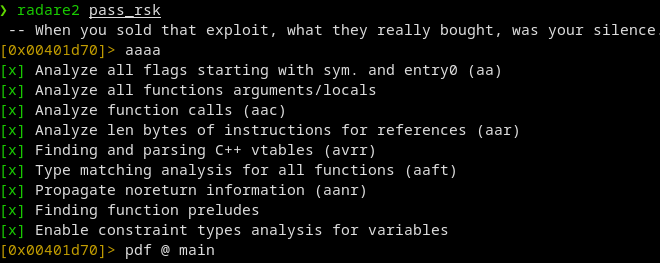
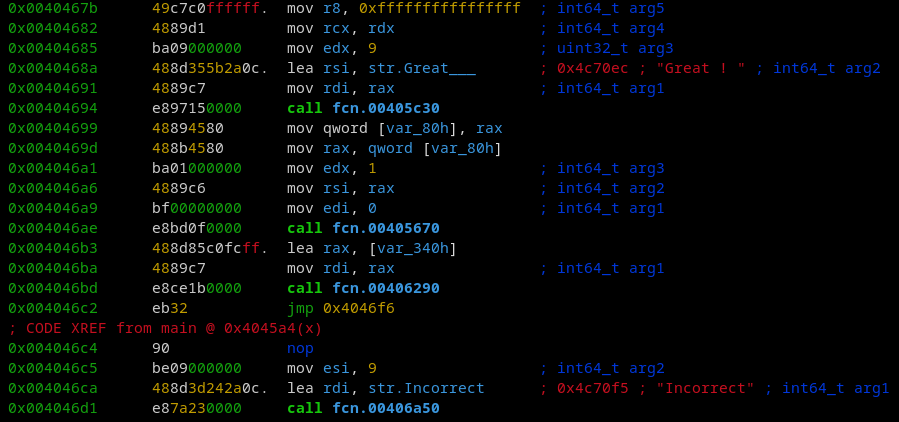
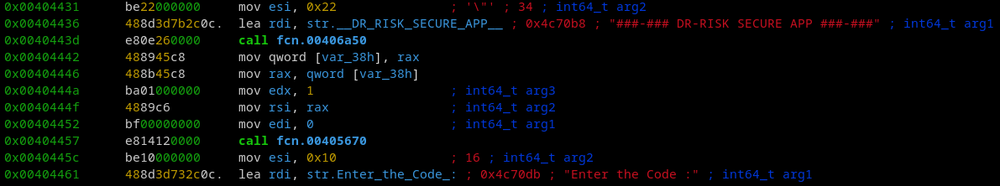
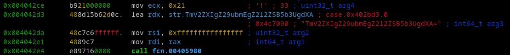
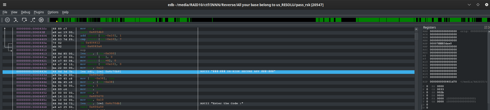
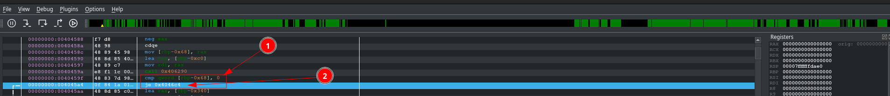
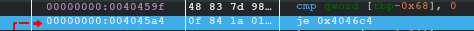
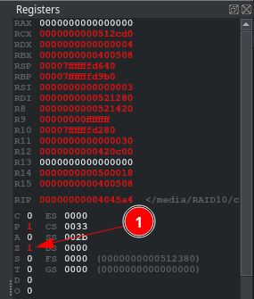
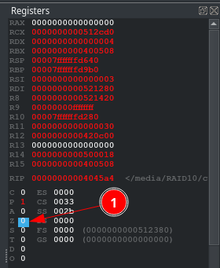
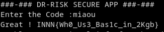

# All your base are belong to us

|difficulté|type|
|:---:|:---:|
|Difficile|Reverse|

## Énoncé
Incroyable ! Le Dr Risk a laiss\u00e9 un de ses programme disponible en Torrent. Nous avons rapidement r\u00e9cup\u00e9r\u00e9 l'executable.


Mais il semble \u00eatre prot\u00e9g\u00e9....

SHA256 825b8140743b6eafe44938037e027e22281371065a9aee06f43cc5b26de78820

## Analyse

Allez, c'est parti, on refait chauffer les outils d'analyse !

J'ai oublié de le faire sur mycode, mais on commence par faire un **file** pour avoir des informations sur l'executable:

```bash
file pass_rsk
pass_rsk: ELF 64-bit LSB executable, x86-64, version 1 (SYSV), statically linked, no section header
```

Un petit coup de strings sur l'executable:
```bash
string pass_rsk
UPX!
p/pL
[…]
```

Oh ! [UPX](https://upx.github.io/), my old friend ! Cela fait des années que je n'ai pas rejoué avec toi mon ami !

UPX est un packer, il sert à réduire la taille des applications tout en rendant plus difficile son analyze, si vous tentez de le reverse sans l'unpack, vous ne trouverez absolument rien,
car le programme se charge en mémoire quand vous l'executez.

Bon, c'est un CTF, sous linux je n'ai jamais fais de manual upack sur ce système, donc nous allons utiliser la fonction intégrée d'UPX pour **unpack** pass_rsk:

```bash
❯ upx -d pass_rsk
                       Ultimate Packer for eXecutables
                          Copyright (C) 1996 - 2020
UPX git-d7ba31+ Markus Oberhumer, Laszlo Molnar & John Reiser   Jan 23rd 2020

        File size         Ratio      Format      Name
   --------------------   ------   -----------   -----------
   1057696 <-    416276   39.36%   linux/amd64   pass_rsk

Unpacked 1 file.
```

## Reversing that baby

Désormais, nous avons accès au binaire en lui même et nous allons pouvoir l'analyser de nouveau avec radare2:



puis nous allons remonter jusqu'au début et rechercher des informations qui pourraient nous être utile:



Comme cette information ci-dessus, nous allons avoir une comparaison, qui nous affichera soit **Great !** soit **Incorrect**.



Ensuite nous avons le greeting de l'application qui va être affiché dans la console.



Une nouvelle chaine en base64 **TmV2ZXIgZ29ubmEgZ2l2ZSB5b3UgdXA=**, je vous laisse la déchiffrer.

Bon, à première vue, rien d'obvious sur le flag, nous allons donc continuer l'analyse, j'ai choisi de passer à l'analyse dynamique, car comme il y a une validation de la condition, nous avons un moyen de modifier de comportement de l'application.

Après avoir analysé le programe (**CTRL+A**), nous allons chercher le début de programe, et donc les chaines suivantes:

```bash
###-### DR-RISK SECURE APP ###-###
Enter the Code :
```

Nous les trouvons ici:



Nous allons chercher la comparaison qui va nous faire jump soit sur goodboy où sur badboy, nous allons la trouver ici:



* 1 - Comparaison à effectuer 
* 2 - Action à effectuer si la comparaison échoue (jump @BadBoy)

Et vous savez quoi, il est possible de changer le résultat d'une condition en live avec EDB, nous allons donc en profiter pour tromper le programme, et lui dire que mon code *miaou* est le bon:

Comme prévu, le code est faux, et le jump est pris:



Mais comme je vous ai dit, nous pouvons changer le résultat, dans les registres, nous allons modifier le registre "Z":



Un double click dessus, et nous allons annuler le jump, aussi simplement que cela:



On presse (**F9**) pour terminer le programme, et dans la console nous avons ce magnifique flag:



Le flag était donc:

>INNN{Wh0_Us3_Bas1c_in_2Kgb}
