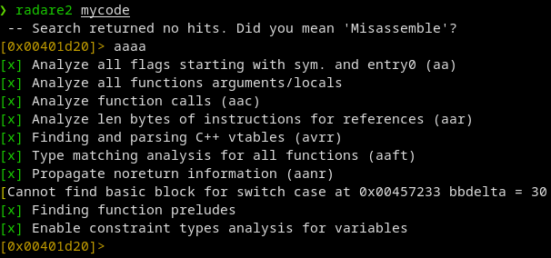
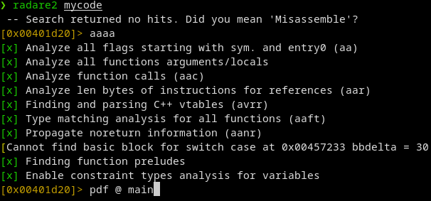
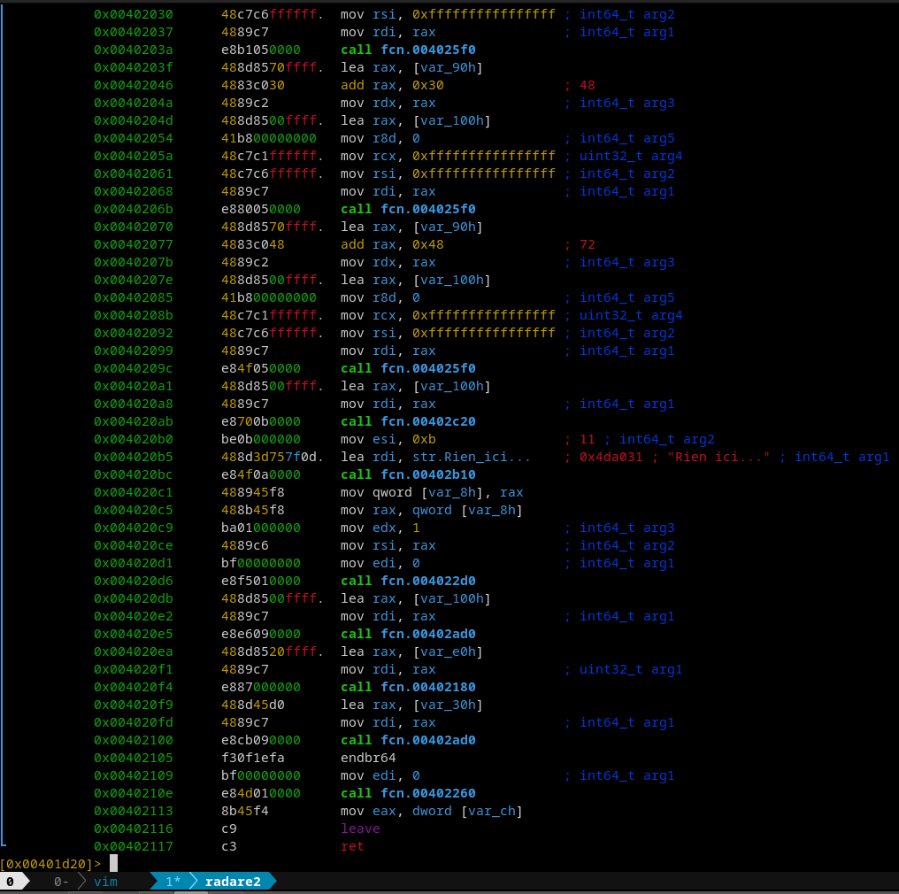
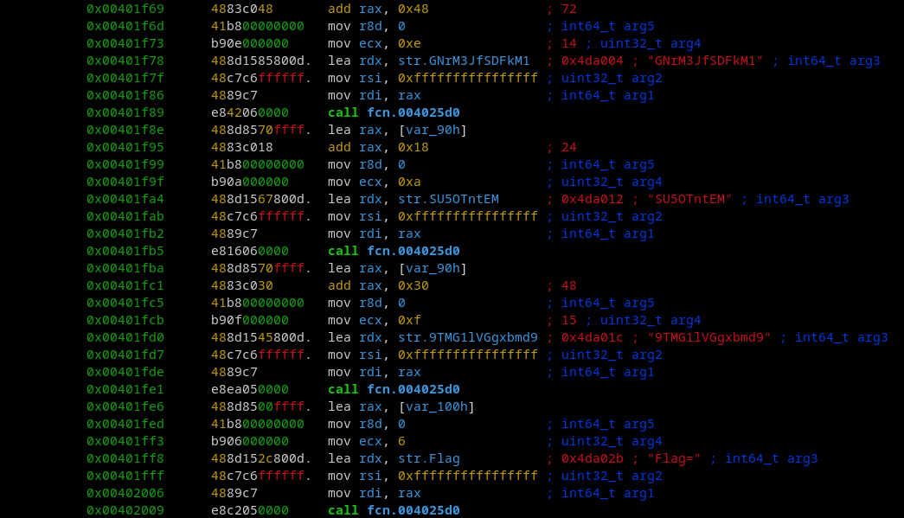
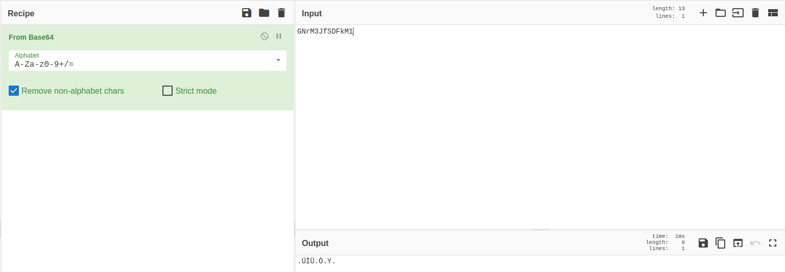
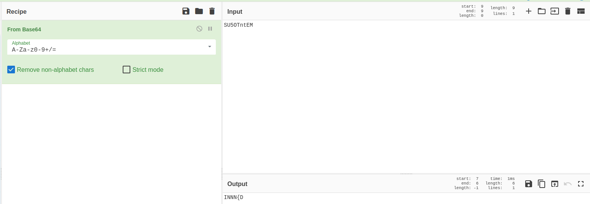
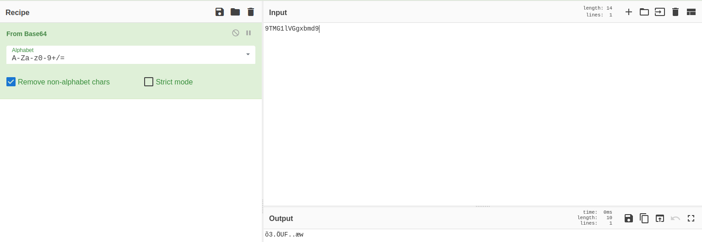
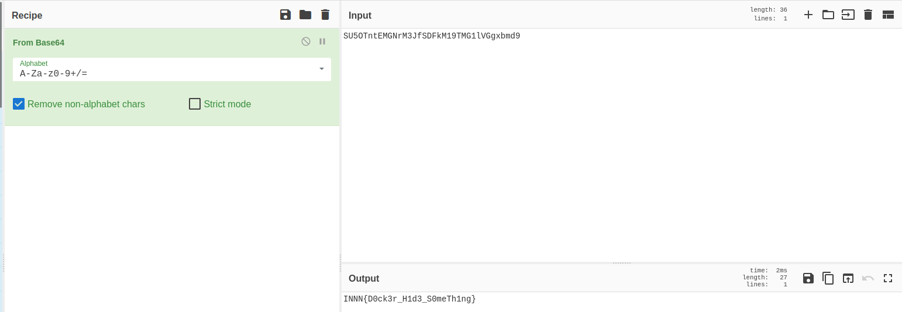
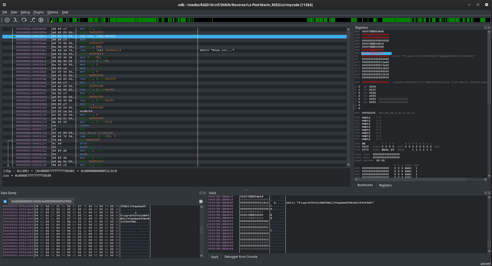

# Le Pied Marin

|difficulté|type|
|:---:|:---:|
|Moyen|Reverse|

## Énoncé
Par chance, nous avons r\u00e9ussi \u00e0 trouver une information sur un container dans un syst\u00e8me appartenant au Dr Risk.


Votre expertise pourra surement nous aider \u00e0 trouver des \u00e9lements int\u00e9ressants !

registry.eu-west-0.prod-cloud-ocb.orange-business.com/risk-corp/nothing_app:latest

## Analyse

Dans l'énnoncé, nous avons une addresse, cette adresse est un repo pour Docker. Pas de chance pour moi, je n'ai encore jamais travaillé dessus, mais bon, ce n'est pas cela qui va m'arrêter non ?

On va commencer par importer l'image dans notre Docker:

```bash
sudo docker pull registry.eu-west-0.prod-cloud-ocb.orange-business.com/risk-corp/nothing_app:latest
```

On vérifie que l'image est bien disponible ensuite avec la commande suivante:

```bash
sudo docker image list
REPOSITORY                                                                    TAG       IMAGE ID       CREATED         SIZE
registry.eu-west-0.prod-cloud-ocb.orange-business.com/risk-corp/nothing_app   latest    2899bf5af390   2 months ago    2.38MB
```

Une fois l'image récupérée, nous allons partir à l'analyser, mon premier réflèxe est d'essayer d'obtenir un shell pour naviguer dans le containeur.

```bash
sudo docker run -it registry.eu-west-0.prod-cloud-ocb.orange-business.com/risk-corp/nothing_app sh
```

Nous arrivons dans le shell du docker, c'est parti pour l'énumération:

```bash
❯ sudo docker run -it registry.eu-west-0.prod-cloud-ocb.orange-business.com/risk-corp/nothing_app sh
/ # ls
bin     dev     etc     home    mycode  proc    root    sys     tmp     usr     var
/ # 
```

Nous avons un binaire, *mycode* qui est présent à la racine, je suppose que c'est l'application qui sera servie pas le containeur.
Si nous l'executons, nous avons ce message:

```bash 
/ # ./mycode 
Rien ici...
/ # 
```

Bon, rien d'obvious, mais on ne sait jamais, gardons cette informations dans notre fichier d'indices:

```bash
echo "binaire servi par Docker: /mycode"
```

On va ensuite rechercher si des fichiers pourraient contenir des informations spécifiques (credentials, document texte, …).

La recherche ne donne rien, donc le binaire est ce qu'il faut attaquer.

## Reverse de mycode

Dans l'image Docker, il n'y a pas d'outils pour reverse le binaire, il va donc falloir trouver une solution, elle a été trouvée par Chickenrunnn via la commande suivante:

>Chickenrunnn — 09/23/2022
>J’ai un peu galéré, j’ai essayé à coup de vim, et autres bordels
>Mais en fait y’a
>docker cp containerID/path/to/file path/to/copy
```bash
sudo docker cp registry.eu-west-0.prod-cloud-ocb.orange-business.com/risk-corp/nothing_app/mycode .
```

Une fois mycode extrait du containeur, nous allons pouvoir utiliser les outils habituels (strings, radare2, edb, ghidra …)

Strings ressort trop d'informations, et rien de concluant, je vais donc commencer mon analyse avec radare2:



Une fois l'analyse terminée, nous allons décomposer le main du programe avec la commande suivante:



La console nous affiche un magnifique pavé en assembleur, mais n'ayons pas peur, et navigons un peu dans le code:



Nous retrouvons bien notre **Rien ici…** en ligne **0x004020b5**, nous allons remonter un peu dans le code jusqu'à trouver cette construction:



Il est censé nous afficher le flag ! nous avons bien vu, la solution est dans le code, les trois chaines au dessus sont encodée en base64, et les trois réunies vont nous donner le flag.
La reconstruction de la chaine se fait via la fonction **fcn.004025d0**.

## Première solution, dirty but worky

alors, je n'en suis pas fier, mais au moins, elle permet de flag très vite. Nous savons que les 3 chaines assemblées forment le flag, nous allons donc les passer dans cyberchef et obtenir le flag:

chaine 1:


chaine 2:


chaine 3:


Bon heureusement que la 2nd chaine nous donnes le début du flag, car cela conforte notre idée, nous pouvons donc tester les différentes possibilités de création de flag, soit :

>chaine2+chaine1+chaine3

ou 

>chaine2+chaine3+chaine2

Une fois la chaine 2 associée à la chaine 1, nous avons le flag qui commence à se construire:


La construction finale est donc **chaine 2 + chaine 1 + chaine 3**:



le flag est donc:
>INNN{D0ck3r_H1d3_S0meTh1ng}

## Seconde solution, reverse like a boss

La dirty ayant permi de flag le chall, nous pouvons nous demander, mais pourquoi créer une réponse **flag=** et ne pas l'utiliser ?

En utilisant un live debbuger comme edb, nous allons pouvoir voir de manière dynamique comment est créé le flag.
Pour cela il faut mettre un breakpoint (F2) sur la ligne **0x00401f78** puis appuyer sur (F8) jusqu'à arriver au dessus de la ligne qui contient **ASCII:"Rien ici…"**, et regarder dans le stack mémoire (en bas à droite):



Le flag est faux, comme vous pourrez le constater, je suppose qu'il y a eu une erreur dans le code.


